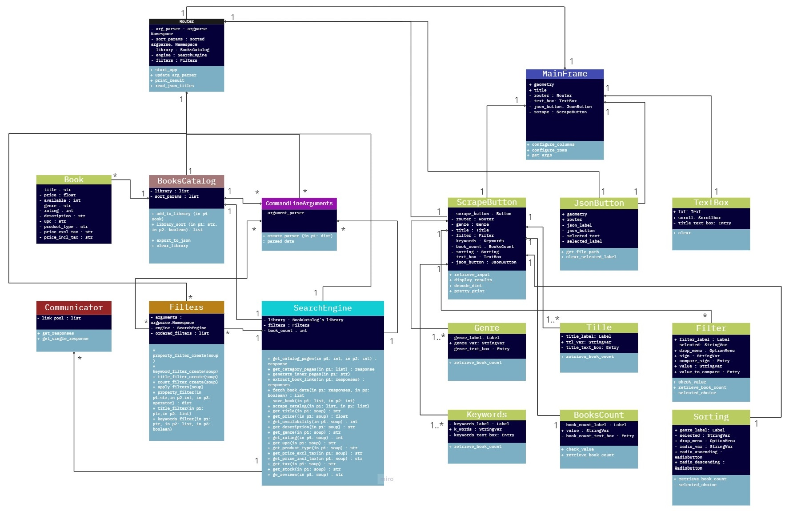
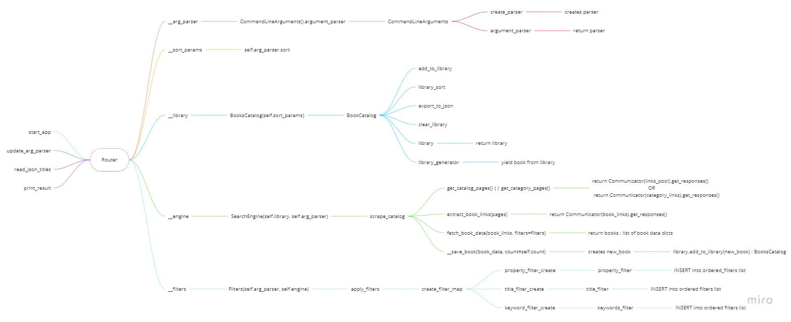

# BookScraper S03-Py-team-3

* ## Project Summary

*Book Scraper is a Python application that scrapes the book catalogue website, http://books.toscrape.com. It then allows
you to sort the data based on a given criteria, like price, rating, genre etc.*

## Table of Contents

- [BookScraper](#bookscraper-s03-py-team-3)
    - [Table of Contents](#table-of-contents)
    - [Requirements](#requirements)
    - [Usage](#usage)
    - [Tests](#tests)
    - [Technical Details](#technical-details)
        - [Workflow](#workflow)


* ## Requirements

*What are the requirements needed to be able to run this project.*

* This script uses [virtualenv with python2](https://docs.python.org/2.7/)
* To run the script successfully you must have access to *main.py*
* To run the script successfully you must have first installed *requirements.txt*
  ```sh
  beautifulsoup4==4.9.3
  gevent==20.12.1
  grequests==0.6.0
  lxml==4.9.1
  requests==2.27.1
  coverage
  mock~=3.0.5
  ```
* requirements will be installed using:
    * ```pip install -r requirements.txt```

* ## Usage

The script is used to gather data from https://books.toscrape.com/. You can write the following command in your
terminal:

##### Example usage

  ```
  python main.py [-h] [-d <keywords>] [-g <genre>] [-f <filter>] [-n <number>]
                 [-n <number of books>] [-g <fantasy>]
                 [-b <number of books>] [-f <price>]
                 [-b <number of books>] [-d <travel>] 
                 [-X <anything>]
  ```

About the optional arguments:

````
optional arguments:
  -h, --help          show this help message and exit
  -d, --description   description keywords
  -g, --genre         genre
  -f, --filter        filter
  -n, --number        number of books
  -t, --title         book title
  -F, --json          <filename>.json5
  -s, --sort          sort (ascending/descending)
  -X, --gui           graphical user interface
````

* ## Tests
  #### Unit tests:
  ##### Bundle **tests**, **coverage** and **report** with bash script -  ``` .\run_tests.sh ```
  ##### Run all tests with - ```  python -m unittest discover . ```
  ##### Run coverage for all tests with - ``` coverage run -m unittest discover . ```
  ##### Get Coverage report with - ```` coverage report ````

* ## Technical Details



### Workflow:



#### 1.

* Once you start the application, the preferred arguments will be parsed through the **Command Line
  Arguments** `argument_parser` function.

  ##### 1.1.
    * If no given arguments the application will scrape the data by invoking the `start_app` function of the **Router**,
      which will start the scraping of the website by calling the `scrape_catalog` function inside the **Search Engine**
      module. This will _generate_ a '_pool_' of pages and call the `extract_book_links` method with those pages'
      responses provided by the **Communicator's** `get_responses` function, which is using **GRequests** for _async
      requests_. Based on those responses the method will extract the links for each book and return responses through
      the same
      **Communicator's** `get_responses` function. They will be passed to the `fetch_book_data`
      and since in this case there are no filters to comply with, the method will fetch the data with the help of **
      BeautifulSoup**, and create a _list_ of dictionaries that later will be used in the `save_book` function to create
      a new **Book** instance, which will be added to the **Books Catalogue** library through the `add_to_library`
      method. Finally, the `library` is exported into a **JSON** file and displayed in the terminal.

  ##### 1.2.
    * If the `-X` argument is active the **Graphical User Interface** will be prompted, and you'll have the chance to
      update the arguments you've chosen or introduce additional ones. Once you're done with that and hit the _scrape
      button_, the `retrieve_input` function will be activated, which activates a list of functions to retrieve all the
      necessary input you've placed within the GUI's entries and create a **dictionary** with it. Those functions
      include
      `retrieve_genre`, `retrieve_title`, `retrieve_keywords`, `retrieve_book_count`, `retrieve_filter_data`
      and `retrieve_sorting_data`. Once that's done the resulting **dictionary** is passed through to the **
      Router's** `update_arg_parser` function, where all the arguments are updated and parsed. Once that's done the **
      Router's** `start_app` function is called. Within that function, there will be multiple validations of whether
      the _**scrape**_ should be made by **genre**, **title(s)**, or if there is a certain filter to comply with, like _
      price_ or _rating_ below a certain _value_
      or vice versa. The _filter_, if any, will be applied through the `library_sort` function and finally exported to
      the **JSON** file, which will be displayed on the text box of the application's **GUI**.

  ##### 1.3.
    * If the `-X` argument is not active the arguments will be parsed through the
      **Command Line Arguments** `argument_parser` function and the **Router's** `start_app` method will be called.
      Within that method, we start off by checking if the **JSON** argument is active, and if so, we read the given **
      JSON** file and return a _list_ of _titles_. With that _list_ of _titles_, we update the **title argument** within
      the `arg_parser`, and we call the `scrape_catalog` function with the additional _filter(s)_ if any. Otherwise, if
      the **JSON** argument is not active, we check if the _genre_ is provided, and we call the **Search
      Engine's** `scrape_catalog` function with the additional _filter(s)_ if any. Within the function, we also clarify
      if there's a **book count** we must comply with, otherwise, we scrape the website by the proved scheme in **(
      1.1)**.

  ###### 1.3.1
    * If the **JSON** and **genre** arguments are not provided, we call the
      **Search Engine's** `scrape_catalog` function with the additional _filter(s)_ only, and we continue with the
      provided scheme in **(1.1)**.
